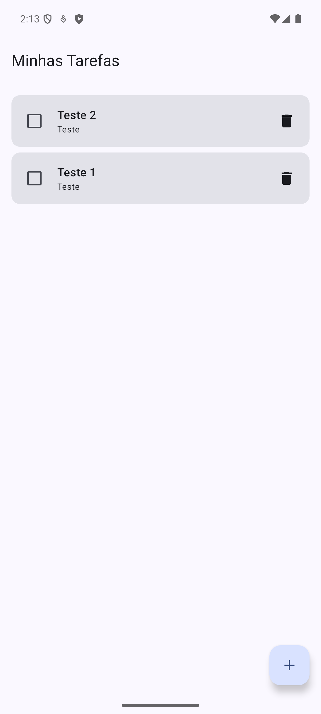
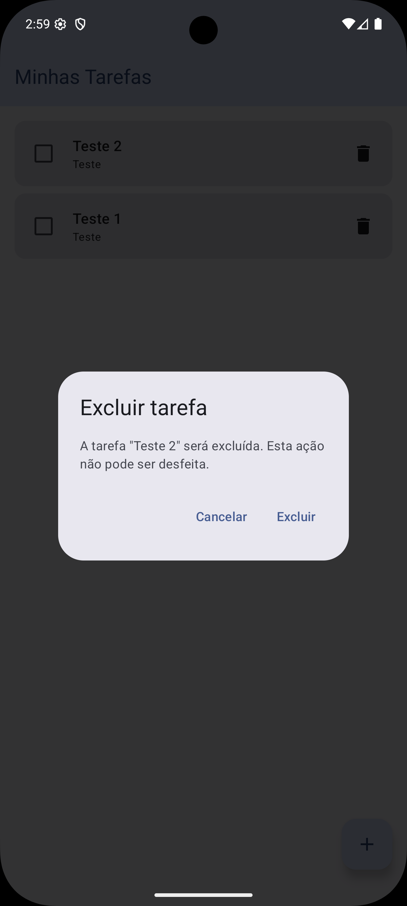
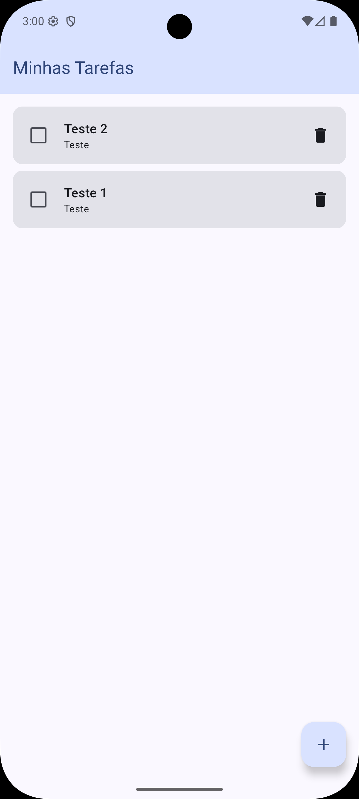
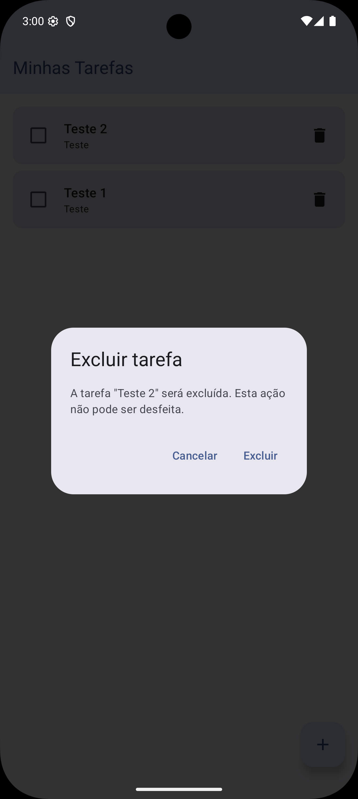
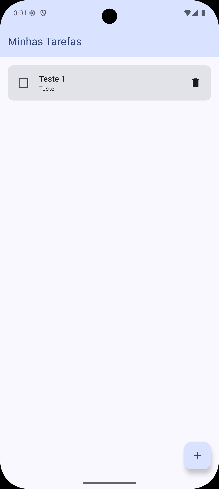

# Evidências — confirmação de exclusão de tarefa

Implementação de diálogo Material 3 sobre a lista de tarefas: a lixeira não remove o item na hora. O usuário confirma ou cancela antes da exclusão definitiva.

Arquitetura preservada: Compose UI → ViewModel → Repository → DAO → Room.

## Sequência no emulador

### 1. Lista antes da exclusão

Duas tarefas visíveis. Nenhuma exclusão feita ainda. A tarefa que será alvo do teste aparece na lista.

### 2. Diálogo aberto com a tarefa selecionada

Toque no ícone de lixeira da tarefa escolhida. O `AlertDialog` abre **sobre a lista** (não é uma tela nova), informa que a tarefa será excluída e mostra o título selecionado. Botões **Cancelar** e **Excluir**.

### 3. Resultado ao cancelar

Toque em **Cancelar**. O diálogo fecha e a lista permanece igual: as mesmas tarefas, inclusive a selecionada inicialmente.

### 4. Nova abertura do diálogo

Novo toque na lixeira da mesma tarefa. O diálogo abre de novo.

### 5. Resultado após confirmar a exclusão

Toque em **Excluir**. O diálogo fecha e **somente** a tarefa selecionada some. As demais permanecem.

